# Introduction to Google Cloud AutoML Vision

With the rapid development of technology, a Data Scientist could archive their job like training ML models faster. The Word &quot;AutoML&quot;(also known as Automated machine learning) comes and now plays a crucial role in studying ML. Their work has been promoted to a new level compared with the traditional way of creating an ML model. The three big cloud platforms(GCP, Azure, AWS) now provided a variety of resources for Machine learning, especially AutoML. This blog will go through from introduction to AutoML to create an AutoML application.

1. **Introduction:**

    **Automated machine learning** ( **AutoML** ) is the process of [automating](https://en.wikipedia.org/wiki/Automation) the tasks of applying [machine learning](https://en.wikipedia.org/wiki/Machine_learning) to real-world problems.


    AutoML covers the complete pipeline from the raw dataset to the deployable machine learning model.

    


    The high degree of automation in AutoML allows non-experts to make use of machine learning models and techniques without requiring them to become experts in machine learning.

    Normally, a scientist must apply appropriate pipeline: **data pre-processing** , **feature engineering** , **feature extraction** and **feature selection methods** to create a model. Now, they can really simplify every step that takes more time to a Data Scientist&#39;s work above from scratch, and spend the remaining time focusing on improving the knowledge of the business, analyzing data, extracting features and preparing data to be trained.

    These 2 important stages in AutoML are Feature extraction and Hyperparameter optimization.

    - Feature extraction: In real work, Machine learning models need a large amounts data to be trained. These data will be huge and hard to understand. Feature extraction is a part of the dimensionality reduction process, to say simple, raw data is divided and reduced to more manageable groups. These large datasets have a large number of variables, which require a lot of computing resources to process them. The technique of extracting the features is useful when you have a large data set and need to reduce the number of resources without losing any important or relevant information. Feature extraction helps to reduce the amount of redundant data from the data set.

    - Hyperparameter optimization: All the machine learning models have parameters, it is meaningful and affects directly to the quality of ML model. Hyperparameters can easily be set by hand and optimized by trial and error and it also can be set automatically these parameters to optimize performance or can say solving the machine learning problem. Without an automated technology like AI Platform Training hyperparameter tuning(applying AutoML), you need to make manual adjustments to the hyperparameters over the course of many training runs to arrive at the optimal values. Hyperparameter tuning makes the process of determining the best hyperparameter settings easier and less tedious.

    Comparison between AutoML Pipeline and Traditional pipeline:

    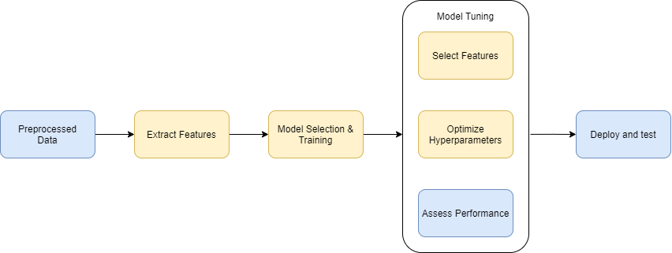

    These steps in yellow boxes will be automatically handled by AutoML. Programmers don&#39;t need to worry about how to configure, optimize these steps.

2. **Pros and Cons:**

    AutoML helps scientists to do their job automatically without repeating the boring tasks that require coding skills for a data scientist. Without AutoML, they must create their own ML pipeline from the beginning. Each ML model has its own properties so it requires lots of time to complete a pipeline to create a model.

    On the other hand, AutoML is just a software, therefore it always needs an ML engineer to work with it. Indeed, before using a model trained by AutoML, its results must be validated many times by an expert Data Scientist to make sure they are correct.

3. **AutoML Echo System:**

   1. Echo System:

        There are several AutoML products developed by Google such as:

        - AutoML Natural Language
        - AutoML Tables
        - AutoML Translation
        - AutoML Video Intelligence
        - AutoML Vision

        These state-of-the-art AutoML features help you to automatically build and deploy machine learning models quickly and without worrying about your ML Skills, handle problems for your business needs.

        For studying purposes, we will dive into AutoML Vision and create a demo application.

   2. Base Knowledge AutoML Vision:

        Google AutoML Vision is a machine learning model builder for image recognition, offered as a service from Google Cloud.

        AutoML Vision allows you to train your custom model in an efficient way from labeled images. The results will be evaluated to get the highest performance.

        AutoML Vision provides a service called Cloud hosted to register trained models on cloud for serving through the AutoML API.

   3. Workflow:

        To start creating a AutoML vision, we must go through 5 steps from collecting dataset, validating dataset, labelling dataset, training model and deploying before we can use it.

        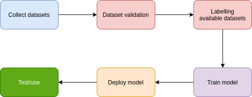


4. **Coding:**

    In this tutorial, we will go through from the very beginning Introduction to create a real AI application for Cats - Dogs Classification using AutoML Vision and deploy to Cloud Run step by step.

    **Prerequisites:**

    You must have at least experiences with these programming languages:

    - **Python 3.8**
    - **JavaScript**

    Technologies used:

    - **FastAPI** : a modern and fast Python web framework for building backend applications.
    - **VueJS** : an open-source model–view–viewmodel front end JavaScript framework for building user interfaces and single-page applications.
    - **Docker:** a set of platform as a service products that use OS-level virtualization to deliver software in packages called containers.
    - **Cloud Run** : Develop and deploy highly scalable containerized applications on a fully managed serverless platform.

    **Settings up:**

    First thing to do is collect datasets(images). We will download a dataset from [kaggle.com](https://www.kaggle.com/c/dogs-vs-cats/data). After downloading, we extract downloaded file and ready to train.

    Secondly, you must set up Billing for your Google Cloud Account first and enable Vision AI feature. You will have 300$ for Free Trial.

    Please refer to this [link](https://cloud.google.com/vision/docs/setup) for setting up the Vision API.

    **Train model:**

    - Navigate to AutoML Vision.
    - Create a new Dataset with option **Single-label Classification**.

    

    - Import Image by uploading from Computer or select a CSV file on Cloud Storage.

    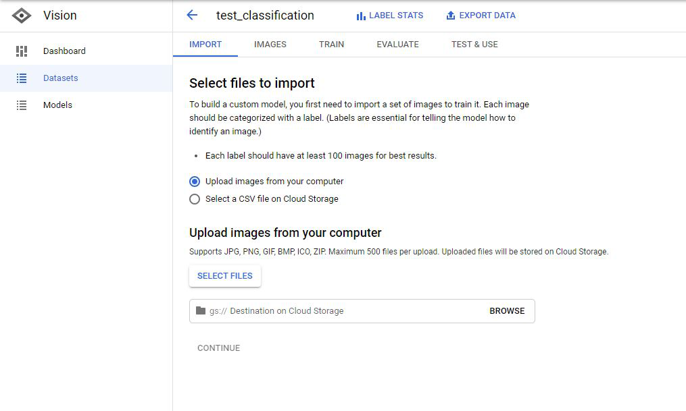

    Figure 3: Import screen

    - Create 2 labels with the name: dog and cat.
    - Labelling these unlabelled images with appropriate dog or cat

    Next, we will train our model by clicking on TRAIN

    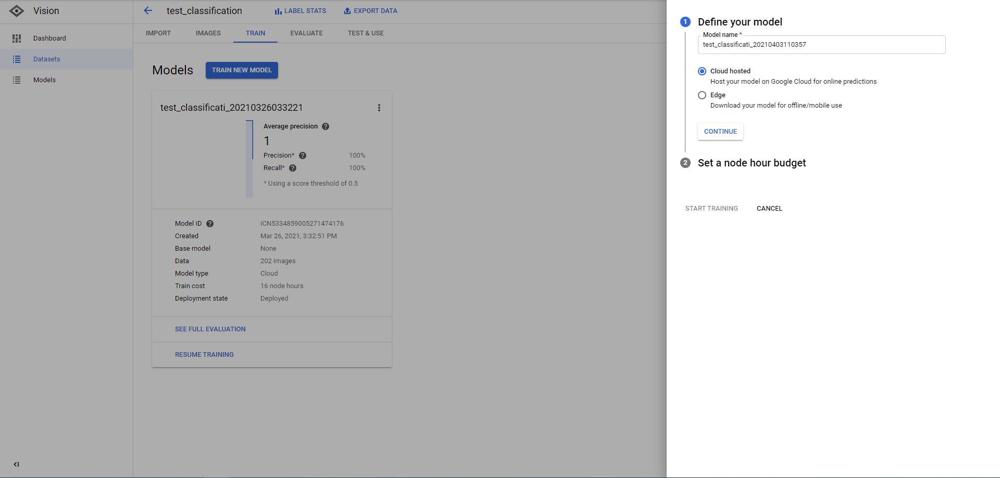

    Figure 4: Train model options

    There are 2 options:

    - Cloud Hosted(choose this): Create a online model and prediction
    - Edge: Download model for offline use

    - Select a node hour budget:

    **IMPORTANT!!**

    Before doing this action, you must read carefully this link about [pricing](https://cloud.google.com/vision/automl/pricing).

    In short, the cost for training a model with (200 images) will be 8 node hours.

    You can try this if you have Free Trial. If not, you will be charged

    **8 \*** **$3.15 = $25.2 + $1.25(for deploy) = $26.45**

    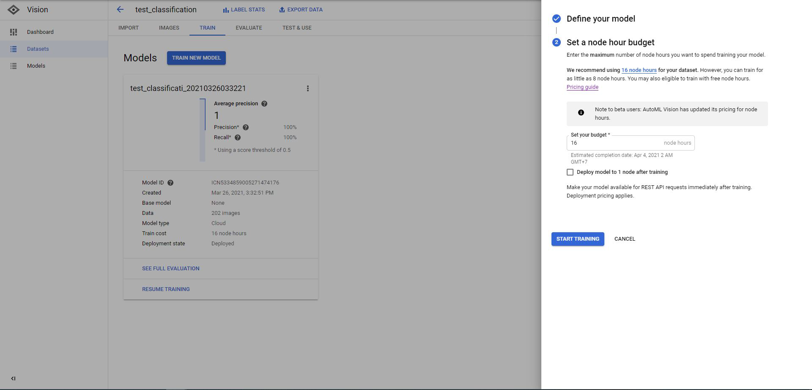


    - Click START TRAINING. Training time will be 2~3 hours.
    - After finishing training, you can see your Model Evaluation by navigating to EVALUATE tab.

    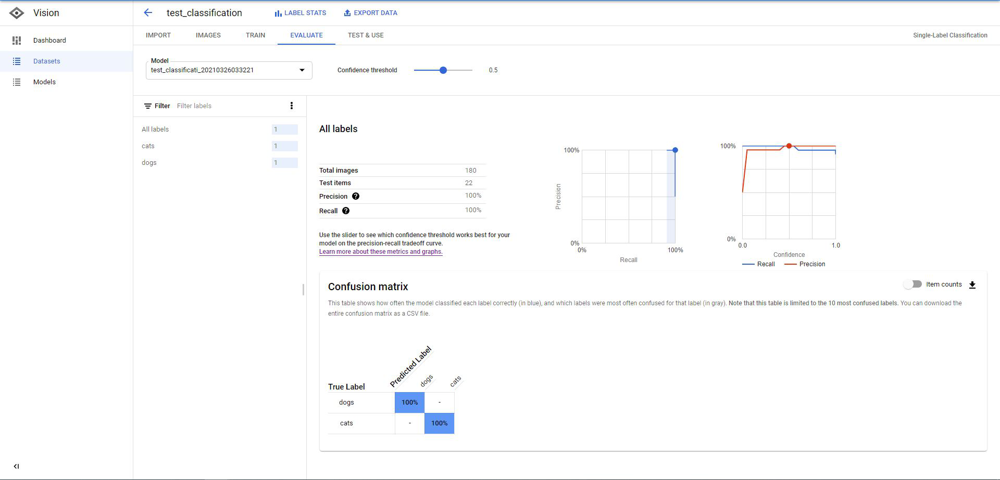

    Figure 6: Evaluate model

    - Let&#39;s test our model. Input any picture and see the result.

    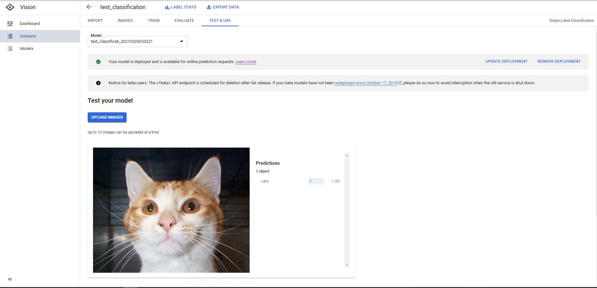

    Figure 7: Test model

    Cool, our model is quite accurate. Next step, we will build a Web Application so anyone can perform online prediction.

    **Develop Back-end**

    - Setup environment:

    I already had the requirements [file](https://github.com/tkppro/python-google-automlvision/blob/c9d8a3345248cade2d8e759dd3d01345fd2a2125/requirements.txt) for libraries to install all dependencies we will use for our project. Download it and put into our project folder and run below commands:

    ```bash
    $ pip install poetry 
    $ poetry install 
    ```

    Our project structure will be organized like belows:

    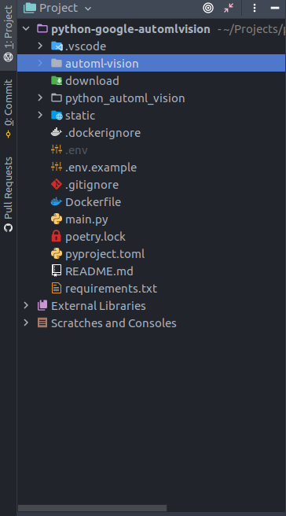

    Next, open main.py. Our code will look like:
    ```python
    from fastapi import FastAPI, File, APIRouter, HTTPException, Body
    from starlette.middleware import Middleware
    from starlette.middleware.cors import CORSMiddleware
    from starlette.staticfiles import StaticFiles

    from python_automl_vision.services.services import (
    predict, get_sample_online_predict)

    app = FastAPI(middleware=[Middleware(
                CORSMiddleware,
                allow_origins=[*],
                allow_methods=[*],
                allow_headers=[*],
            )
        ]
    )

    api = APIRouter()

    app.include_router(api, prefix="/api") |
    ```

    Add api for prediction:
    ```python
    @api.post("/predict")
    async def predict_image_file(
    file: bytes = File(None),
    is_uploaded: bool = Body(True),
    blob: str = Body(None),
    predict_type: str = Body("ONLINE_PREDICT"),
    ):
        if not file and is_uploaded:
            raise HTTPException(status_code=400, detail="File must not be empty!")
        results = predict(file, is_uploaded, blob, predict_type)
        return results
    ```
    ```python
    def predict(content, is_uploaded=True, blob="", predict_type="ONLINE_PREDICTION"):
        PROJECT_ID = "your project id"
        MODEL_ID = "your model id"
        if predict_type == "BATCH_PREDICTION":
            return batch_predict()

        file_download = "";
        # Get the full path of the model.
        model_full_id = automl.AutoMlClient.model_path(PROJECT_ID, "us-central1", MODEL_ID)
        if not is_uploaded:
            file_download = download_file(blob)
        with io.open(file_download, "rb") as image_file:
            content = image_file.read()
        # Read the file.
        image = automl.Image(image_bytes=content)
        payload = automl.ExamplePayload(image=image)

        params = {"score_threshold": "0.8"}

        request = automl.PredictRequest(name=model_full_id, payload=payload, params=params)
        response = prediction_client.predict(request=request)
        results = {}
        for result in response.payload:
            results = dict(name=result.display_name, 
                score=result.classification.score)

        # remove downloaded file_
        if os.path.exists(file_download) and file_download != "":
            os.remove(file_download)
        return results 
    ```

    Let&#39;s check our api and see the result. Run command to open server on localhost.
    ```bash
    $ uvicorn main:app --host 0.0.0.0 --port 8000
    ```

    Open browser and navigate to [http://0.0.0.0:8000/docs](http://0.0.0.0:8000/docs). Our API has been listed as below.

    

    Input any picture and test this API.

    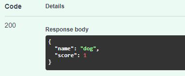

    Nice!! Time to build our front-end.

    **Develop Front-end**

    Let&#39;s create a new frontend application inside folder static.
    ```bash
    $ cd static
    $ npm i -g @vue/cli
    $ vue create frontend
    ```

    I will use [Vuetify](https://vuetifyjs.com/en/) to build our view. Run command to install Vuetify:
    ```bash
    $ vue add vuetify 
    #or 
    $ npm i vuetify
    ```

    For API fetching, I use [Axios](https://github.com/axios/axios) to call api and get results.
    ```bash
    $ vue add axios 
    #or 
    $ npm i axios
    ```

    Now this time you can code your own frontend. I will skip this part and give you an idea about how this page looks. You can also find my source code from my [GitHub](https://github.com/tkppro/python-google-automlvision):

    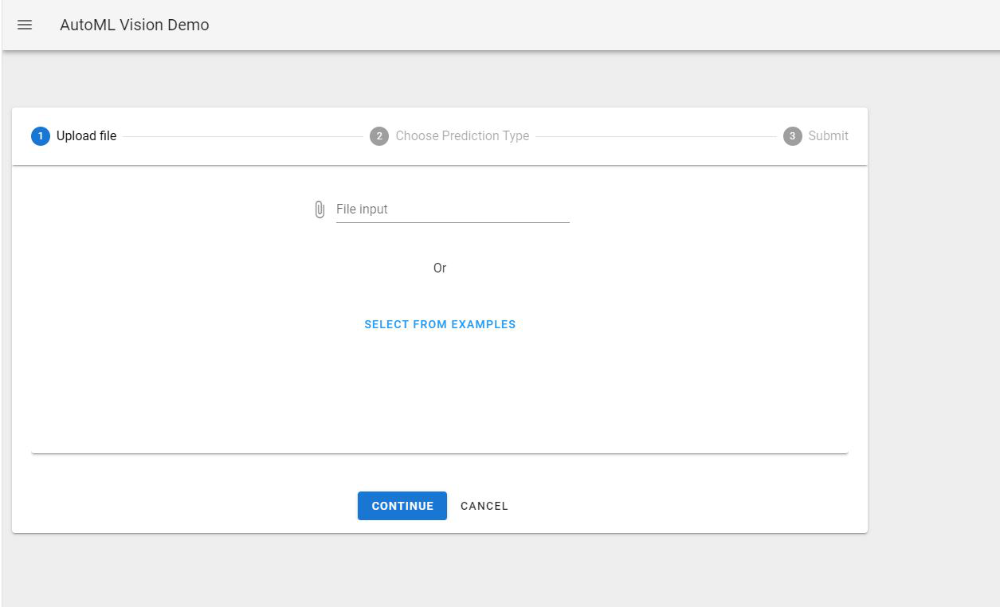

    From the **/static** folder we have just built our frontend. Run command belows to build production. Open [http://0.0.0.0:8000/](http://0.0.0.0:8000/docs) and check our frontend.
    ```bash
    $ cd static
    $ npm run build
    ```

    **Deploy our application:**

    This section will be **Optional**. The purpose of this is to publicize our Prediction API to everyone. You can skip this if you use it by yourself.

    Next, I will build a docker image and push onto **Google Container Registry**. Check **Dockerfile** belows:
    ```docker
    FROM node:lts-alpine as fe-build
    WORKDIR /app
    COPY static/package*.json ./
    RUN npm install
    COPY static ./
    RUN npm run build


    FROM python:3.8 as be-build
    WORKDIR /app
    COPY requirements.txt .
    RUN pip install -r requirements.txt
    COPY . .
    COPY --from=fe-build /app/dist static/dist
    EXPOSE 8000
    ENV PORT 8000
    CMD ["uvicorn", "main:app", "--host", "0.0.0.0"]

    ```

    Firstly, we will build our frontend from **static** folder. Next, the backend will be built step by step as we defined in **Dockerfile**. Then we will copy folder dist from production build to let our backend can touch static files. Adding few codes below at the end of **main.py** to serve it.
    ```python
    #serving static files
    app.mount("/", StaticFiles(directory="static/dist", html=True), 
        name="static")
    ```

    Test our Dockerfile by creating docker image and container.
    ```bash
    $ docker build . -t automl-vision
    $ docker run -dp 8000:8000 automl-vision
    ```

    Submit our docker image to Google Container Registry
    ```bash
    $ gcloud builds submit --tag gcr.io/${YOUR-PROJECT-ID}/automl-vision
    ```

    After all, check this [link](https://cloud.google.com/run/docs/deploying) to setting your application on Cloud Run. The complete scenarios will be:

    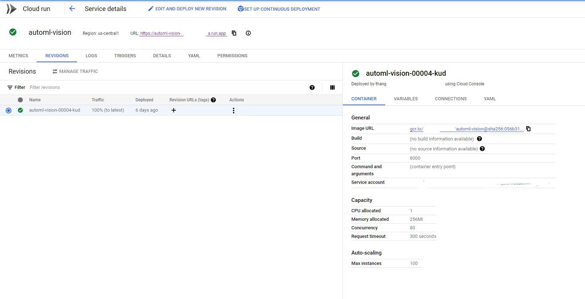

    Final result:

    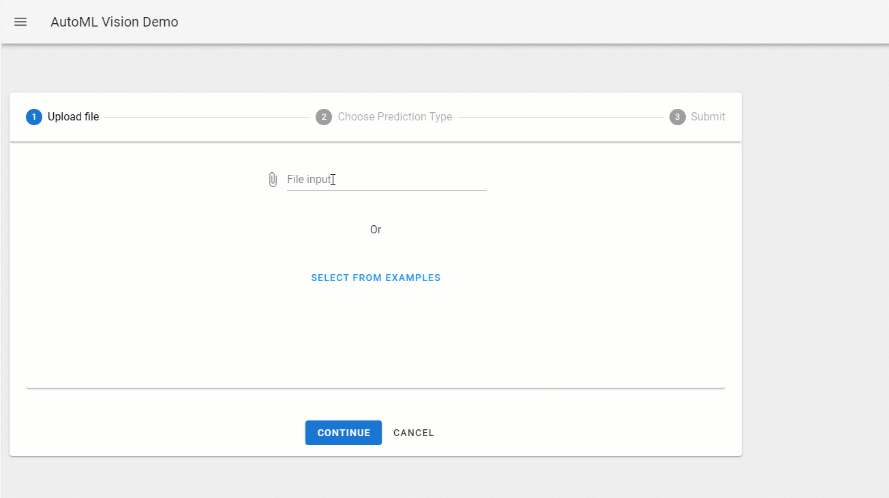

5. **Conclusion:**

    AutoML provides lots of solutions for AI industries and offers an interesting approach that will lower the AI entry barrier in many cases. AutoML brings more opportunities for non-expert programmers who want to apply it for their business domain or studying purpose as well. Therefore, Automated Machine Learning will have a positive impact on AI solutions and technologies in the near future.
